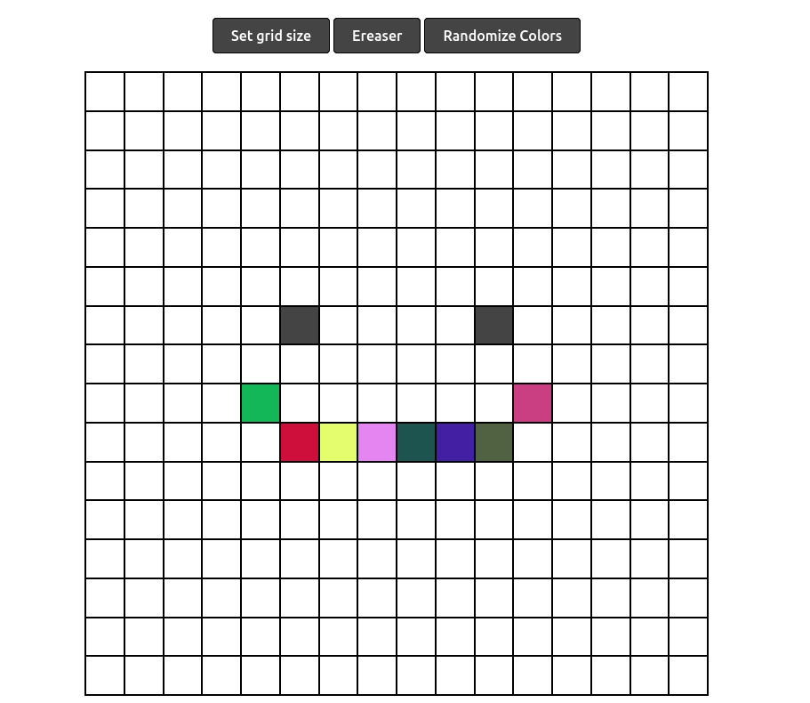

# Etch-A-Sketch

A digital recreation of the classic Etch-A-Sketch toy, built with HTML, CSS, and JavaScript.

## Features

- Responsive drawing grid
- Customizable grid size
- Multiple modes:
  - Classic (Gray)
  - Rainbow
  - White (Ereaser)

## Demo

[Live Demo](https://pective.github.io/etch-a-sketch/)

## Development

Feel free to fork this repository and enhance the application with your own features.
